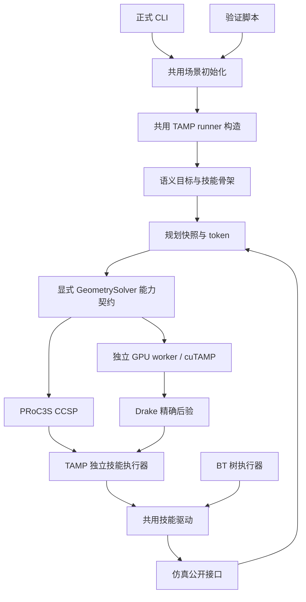

# TAMP 架构修复与验收（2026-09-22）

## 正式入口与验证范围

正式入口为 `scenesmith-plan`，`scenesmith-plan-tamp` 为同一 CLI 的别名。默认保留 STRIPS + sampling 基线；PRoC3S 和 cuTAMP 必须显式选择。旧实现只用于历史对照，命令为 `scenesmith-plan-tamp-legacy` 或显式 `--tamp-mode legacy-vlm-domain`，不属于当前 TAMP 验收。

`planner/src/tamp/application.py:build_runner` 是 CLI 与 `scripts/run_current_tamp.py` 共用的组装路径，统一模型生成器、几何求解器、随机数、恢复预算和执行调度。场景初始化与物体位移共用 `scene_setup.reset_scene`。验证脚本仅增加模型原文记录、可选反事实试验和结果审计；反事实不计入物理成功。

验证预算保存在 `experiments/tamp_current_validation.json`：CCSP 每次最多 16 个赋值，语义重规划 0、技能重规划 1、几何重试 1、技能重试 1、最多执行 6 个技能。验证脚本新增显式 seed，默认 500；此前 unseeded 记录是历史试验，不能与本版混称。

```bash
scenesmith-plan --planner tamp --skill-planner proc3s --geometry-backend proc3s \
  --repository-root "$SCENESMITH_REPO" --scene-root "$SCENE_ROOT" \
  --experiment "$SCENESMITH_REPO/experiments/navigation_picklift_tamp.json" \
  --config "$SCENESMITH_REPO/experiments/tamp_current_validation.json" \
  --task 'Pick up the red object and hold it.' --seed 500 \
  --shift-world-x-m 0.10 --record-html --output-root "$RUN_OUTPUT"
```

cuTAMP 使用同一命令，替换 `--geometry-backend cutamp` 并增加：

```bash
--cutamp-config "$SCENESMITH_REPO/experiments/cutamp/config.json"
```

配置中的 `CUTAMP_PYTHON` 指向 GPU 虚拟环境解释器，`CUTAMP_ROOT` 指向已安装并应用仓库补丁的 cuTAMP 源码。未设置变量或文件缺失会直接报错。模型调用仍需要原有 API 环境变量，证据不记录密钥。

## 八项修复

1. **入口**：共用 runner 与场景初始化；默认基线保持不变；验收直接运行正式 CLI。
2. **共享控制**：导航预检只有 `skills/navigation.py` 一份，始终 fork 调用者快照；PickLift 驱动、导航驱动、闭合回执由 `skills/driver.py` 共用。BT 仍负责树控制流；TAMP 仍执行独立技能。BT 的下一步成功预测通过显式完成判据保留，TAMP 要求观测到成功。
3. **依赖方向**：几何导出、碰撞模型转换、支持面检查、GPU worker 归属 `planner/src/tamp/cutamp_backend`；原脚本是薄入口。worker 使用 `python -m planner.src.tamp.cutamp_backend.worker`，库不再导入 scripts。
4. **快照**：`PlanningSnapshot` 持有独立观测和私有 query 模板，生成物理状态 token。runner 为所有后端检查 world 与快照一致性，规范化当前几何状态。候选 query 独立 fork；外部私有缓存失效操作已删除。token 比较集中在快照边界，后端不再维护逐字段时间对齐协议。
5. **求解器契约**：`GeometrySolver.capabilities` 显式声明搜索失败后的重试能力、反馈用途和排除位置；调度器不再通过 `retry_geometric_unsat` 鸭子属性决策。cuTAMP 如实声明诊断用途和后验排除；此修改没有实现热启动。`scope=skill` 必须有 skill；旧字典没有 skill 时解析为 global。
6. **任务域扩展**：SkillSpec 声明参数采样器和执行绑定；谓词 arity 从注册表生成；PRoC3S 和 CCSP 都读取注册信息。终态目标、cuTAMP 支持骨架集中在 task_domain。新增技能仍需实现其物理检查和执行逻辑；cuTAMP 不支持的骨架明确拒绝，不能仅靠注册声明自动获得优化能力。新技能 Inspect 的注册—生成—CCSP 验证覆盖了第三技能扩展路径。
7. **证据**：取消 tests、pyproject 的忽略，保留并跟踪测试、安装契约和验证配置。每轮运行写入源码清单、内容树 SHA256、Git 状态以及实际源文件压缩包。历史运行不被追认为本次验收。
8. **GPU 边界**：配置和模型模板进入 experiments/cutamp；运行前严格校验所有输入模板/容差/权重/标定、cuTAMP Python 源码集合，以及 GPU Python/计算依赖版本。优化器哈希不再只记录。保存 GPU 依赖锁、官方源码归档哈希与本机补丁。URDF 和 proximity mesh 原有校验继续保留。

## 架构



## 验收与实际边界

测试结果及实际 CLI 运行结果在同目录验收记录中追加。全量测试包含原有 BT、TAMP、仿真接口和安装测试；GPU 专用测试在独立虚拟环境运行。通过架构测试不代表抓取物理成功，也不代表近似碰撞模型完成全面标定。

仍明确保留的能力边界：仅两个生产技能；没有抓住物体后抬升/保持失败的恢复；cuTAMP 仍使用整段求解、执行一步后重观测；反馈尚未驱动 warm start 或连续约束学习；新机器仍需提供场景资产、匹配的上游源码和 CUDA 环境。模板、补丁、依赖锁与哈希用于重建/校验，不把未做过的异机实测称为通过。

## 本次测试结果

- 全量回归：347 项，343 通过、4 跳过，0 失败；645.410 秒。
- 最终 TAMP 回归：131 项全部通过；35.863 秒。
- GPU 独立环境约束测试：10 项全部通过。
- BT 定向测试：27 项全部通过；共享状态与快照契约另有 29 项通过。
- wheel 安装及仓库外 CPU 导入、两个正式命令入口：通过。
- 最终 wheel 在 /tmp 通过真正的独立 GPU worker 完成 64 粒子/2000 步优化，36 个满足近似容差；这是安装与优化链路验证，不是物理任务成功。
- 上游补丁在锁定的原始 cuTAMP 源码上 dry-run：通过。
- 4 个全量跳过项：CPU 环境缺少 Torch 的三个 GPU 测试模块（已在 GPU 环境另测通过），以及未提供 SCENE_ROOT 的独立真实 A 场景测试；后者仍未验收。

源码证据：

- 全量回归和两条正式 CLI 的启动源码内容树：49f444d05a0140d525e351a5197c5ca2b7a05563ac3b7c097ce0a8203a34543a。
- 最终源码内容树：316d5e5eee26c5922a391d83e1e72ec8ef703c831c6d475685001c2393392fc7。
- 差异为 experiments/cutamp/upstream-archives.json, planner/src/skills/driver.py, planner/src/skills/navigation.py, planner/src/tamp/cutamp.py，详细范围见 final-source-delta.json；包定位修改已由最终 wheel 的真实 GPU 运行及 131 项 TAMP 回归覆盖；另有归档提交号记录、patch 上下文空白和 Python EOF 空白整理，后者已检查 AST 不变。
- 每个内容树都保留实际源码压缩包；没有将运行中的早期版本冒充最终字节完全一致的版本。

下列两条正式 CLI 记录使用原预算、seed=500 和物体沿世界 X 轴 +0.10 m
的设置。每轮的完成状态、回放与源码证据由
`runs/architecture-repair-20260922/STATUS.json` 和运行目录保存。
固定种子不保证模型或 GPU 输出逐位相同。

## 2026-09-22 完整仿真历史记录

cuTAMP 正式 CLI 已完成第一轮 GPU 优化、24 个 Drake 后验检查以及一次成功的 NavigateToPick 执行；第二轮优化进程被原有直立底盘限制拒绝：

    ValueError: Planar base optimization requires an upright anchor

该历史运行的 cuTAMP 物理任务未通过，主进程以 CalledProcessError 退出，
未生成正常 result.json；回放在 `cli_cutamp_01/simulation.html`。
原始 STATUS.json 将其记录为 process_error，没有将进程错误推断成几何不可解。
相同错误在更早的 `runs/cutamp-integration-20260922/live_03/cutamp/solve_002/optimizer.log` 中出现过。

本轮没有放宽姿态、碰撞或抬升保持判据。支持停车后的非直立基座，是尚需单独补齐的 cuTAMP 几何能力；它不属于入口/包依赖/状态所有权修复已经通过的结论。

PRoC3S 历史试验以 recovery_preconditions_failed 结束；详细执行次数和耗时见
同目录 STATUS.json。两条试验使用的启动源码已独立归档。
