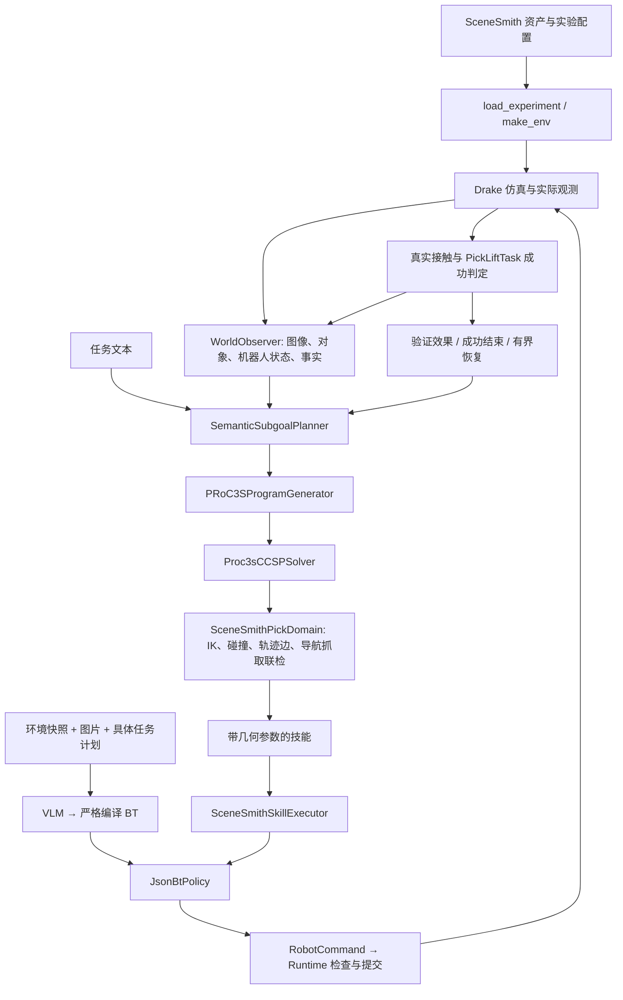

# 当前仿真项目架构报告

日期：2026-09-21。依据开发机当前源码及本次保留的在线成功记录编写。
规划行为基线为 `dce9d32`。当前结构将原 `examples/` 重组为 `planner/`，
原 `src/` 重组为 `simulation/`；并将代码按职责分组。
只调整模块导入、动态入口、资源定位和源码清单范围，未修改提示词内容、规划算法、
控制器、机器人几何或成功阈值。
可直接执行的 Bash 命令见[README](../README.md)。

## 1. 架构总览

本项目消费外部 SceneSmith 场景，在 Drake 中装配 Zerith 机器人、物体、传感器和任务。
BT 与 TAMP 是不同的规划/调度路径；它们共享低层运行环境，并可通过同一
`JsonBtPolicy` 调用导航和抓取。共享入口不意味着两条路径使用相同的抓取轨迹。

图中 BT 的快照输入与 TAMP 的在线观测是两种实际接口，不能互换后仍声称同条件实验。

## 2. VLM → BT

| 环节 | 当前实现 | 实际职责 |
|---|---|---|
| 入口 | `planner/src/tamp/cli.py --planner bt` 或 `planner/src/bt/generation.py` | 接收 `--request`，创建模型客户端 |
| 输入 | `load_request()` | 校验 schema、文件边界、SHA-256、任务计划和图片绑定 |
| 模型 | `OpenAICompatibleChatClient` | 请求兼容 Chat Completions 的服务 |
| 编译 | `planner/src/bt/picklift.py` / `planner/src/bt/navigation.py` | 校验模型返回的两个字段及 MDSL，要求严格匹配输入计划 |
| 树基础 | `planner/src/bt/core.py` | 有限技能注册、节点、解析器与 tick 逻辑 |
| 输出 | `write_result()` | 计划 JSON、BT JSON/MDSL/Mermaid、HTML 树查看器 |
| 可选执行 | `planner/src/tamp/cli.py --execute` → `planner.src.bt.runtime.make_policy()` | 构造共享策略并运行仿真 |

请求包括 `schema`、`request_id`、`environment`、`task`、`observations`、`model`。
当前 PickLift 请求需要头部和左腕两张 PNG；导航 profile 的 `observations` 为空。
BT 模型在既定任务计划上生成可编译的树，不承担 CCSP 站位搜索。
仅改变 `task.description` 不会自动重写已绑定的技能顺序与参数。

仓库现成的 `bt_picklift_first_person/generation_request.json` 是固定机器人历史快照示例，
已在当前源码下重新通过输入校验；它不是本次移动场景的实时感知结果。
`planner.src.bt.generation.PROFILES` 当前没有 navigation+PickLift 联合请求 schema。
手写联合 BT 能由 Runtime 接收，不等于 VLM 生成器已支持对应输入协议。
新场景的输入需要重新提取并绑定，不能只替换图片或坐标而沿用旧哈希。

## 3. VLM → TAMP

推荐对照使用 `--skill-planner proc3s --geometry-backend proc3s`。
正式 CLI 的默认值实际是 STRIPS + SamplingSolver；两者是另一个基线，不能混称 PRoC3S。

| 层 | 文件 / 类 | 输入 → 输出 |
|---|---|---|
| 观测 | `planner/src/tamp/scenesmith_online.py: SceneSmithWorldObserver` | 实测机器人/目标/接触、图像 → `WorldState` |
| 语义 | `planner/src/tamp/semantic.py: SemanticSubgoalPlanner` | 任务文本、标注图像、对象与事实 → 符号子目标 |
| 技能程序 | `planner/src/tamp/proc3s.py: PRoC3SProgramGenerator` | 子目标、前提和技能表 → 开放连续变量的程序 |
| 连续约束 | `planner/src/tamp/ccsp.py: Proc3sCCSPSolver` | 程序、参数域、实测状态 → 首个可行的完整赋值 |
| 几何后端 | `planner/src/tamp/scenesmith.py: SceneSmithPickDomain` | 候选参数 → IK、配置/边检查和几何见证 |
| 技能绑定 | `planner/src/tamp/scenesmith_online.py: SceneSmithSkillExecutor` | 带参数技能 → BT 叶节点与运行配置 |
| 闭环调度 | `planner/src/tamp/online.py: IncrementalTampRunner` | 单技能执行、重新观测、效果验证与有界重规划 |

模型输出被解析为受限制的结构化程序，不是直接运行任意模型生成的 Python。
几何搜索不会自行改写技能程序；超预算失败反馈可交给上层模型修订。

### 技能与事实

| TAMP 技能 | 连续参数 | Runtime 叶节点 |
|---|---|---|
| `NavigateToPick` | `base_pose` | `NavigateTo` |
| `PickLift` | `grasp_pose`、`approach_pose` | `ExecutePickLift` |

当前事实包括 `observed`、`gripper_empty`、`at_pick_pose`、`holding`。
`at_pick_pose` 仍表示站位到达，不是抓取可行性的永久证明。
正式分层 CLI 的终态目标目前固定为目标物体 `holding`；尚不是任意任务/任意技能系统。
`--geometry-backend cutamp` 在该入口明确报未实现；本次路径没有接入 cuTAMP。

## 4. CCSP 检查及其边界

一次外层 trial 先对整段程序的连续变量完成赋值，再从初始状态依次检查。
共享变量保持相同赋值；接受第一个通过的程序，不对所有可行批次全局排序。
本次实验每次求解最多 16 个外层完整赋值。导航候选内部还会枚举抓取几何见证，
单个见证需要多次 IK、配置检查和轨迹边检查，故 16 不等于 IK 调用数。
求解器类默认预算是 250；README 显式配置为 16。

| 检查位置 | 验证内容 | 不保证什么 |
|---|---|---|
| 输入与符号程序 | 对象、技能、参数域、前提与变量一致性 | 不证明运动可行 |
| 导航候选 | 实际 link 变换、局部通道/扫掠与起点几何 | 不证明物理执行无停滞 |
| 导航前联检 | 名义站位至少存在一个完整抓取几何见证 | 不证明实际停车后仍可行 |
| 预抓取/抓取 | 目标构造、IK、关节限制、配置与运动边 | 不证明双侧接触能建立 |
| 提升预测 | 携物假设下的提升端点和关节路径 | 不证明已经抓住物体 |
| 实际执行 | Runtime 的当前状态检查、提交回执 | 请求目标不等于实际已到达 |
| 任务验证 | ContactResults、支撑、抬升、保持和速度 | 不能用单次成功推导普遍可靠 |

CCSP 使用 `simulation/src/geometry/planning.py: PlanningQuery.solve_ik()`：Drake `InverseKinematics`
建立带关节限位、位置/朝向约束和靠近初值代价的非线性优化，再由 `Solve(program)`
选择适用求解器。当前已有按违规碰撞对增添约束的 refinement，最多四轮增补；
每次候选仍独立检查相关几何，不能继续沿用早期“完全不含避碰约束”的描述。
它不是微分 IK；关节运动边由调用方另行检查。

## 5. 共享执行与实际 PickLift

`SceneSmithSkillExecutor._pick_binding()` 把检查结果中的左臂关节解与路径传入
`tamp_joint_skill_plan`。`planner.src.bt.runtime.make_policy()` 在有该参数时选择
`JointWaypointPickLiftSkill`；没有时使用原专家策略 `PickLiftPolicy`。
因此共同的 BT 叶节点下仍存在“专家轨迹”和“CCSP 关节轨迹”两种执行分支。
TAMP 绑定按关节名称传递左臂的七个关节，不能将不同模型的 q 数组按下标互拷。

当前 `JsonBtPolicy._picklift()` 在闭合阶段持续发布专家的最终闭合目标，
默认 0 m；不再每拍从实测开口减去小步长。请求、最终接受回执和实测状态分别记录，
`record_action_result()` 只在 Runtime 确认接受后更新最后接受目标。
该行为是此前用户批准的生产状态，本轮未修改。

必须准确描述当前接触配置：`navigation_picklift_tamp.json` 中目标—手指允许穿透量
为 **1.0 m**，支撑接触为 **0.0001 m**；前者在该对象尺度上大幅放宽了这类几何拒绝。
这是已有实验配置，不可写成仍使用早期 0.1 mm 手指限制，也不可写成所有安全检查都被关闭。
Runtime 仍处理动作合法性、关节约束及配置适用的其余碰撞/接触检查。
这套已授权的仿真配置不是实机安全认证。

名义提升请求保持 0.10 m，导航位置容差 0.005 m。
最终成功必须来自实际任务观测：抬升至少 0.08 m、保持至少 3 s、双侧接触、
脱离支撑、没有意外目标接触，并满足原线速度/角速度条件。
几何见证继续标记 `dynamics_pending`；不能把预测携物或命令 0 m 当作已抓住。

失败恢复先重新观测支撑、左右手指接触与导航起点检查。
没有经过验证的自动接触释放技能时，不会将单侧接触强行改写为空夹爪并启动导航。

## 6. 当前场景运行与正式 CLI 的差异

| 项目 | 正式 `planner.src.tamp.cli` | 本次保留的 unseeded 运行脚本 |
|---|---|---|
| 场景初始化 | 实验配置的原始初态 | 原始初态的红色目标沿世界 +X 平移 0.100 m |
| 任务 | `--task` 文本；终态仍固定 holding | 固定英文抓取并保持任务 |
| seed | 不传时为 500 | `env.reset()` 与 `random.Random()` 不固定 seed |
| CCSP | 配置缺省时 250 | `--max-samples 16` |
| 恢复预算 | 配置的完整 recovery | 语义重规划 0、技能重规划 1、几何重试 1、技能重试 1、最多执行 6 个技能 |
| 附加实验 | 无符号反事实循环 | `--repeats 0` 时关闭该循环 |
| 执行方式 | 增量规划与仿真执行；非纯规划 | 同一核心组件的有界在线实验 |
| HTML | `simulation.html` | 按结果命名 success/failure HTML |

物体平移发生在模拟初始化，机器人初始位姿不变；后续执行不瞬移、不附着物体。
该 runner 位于 `scripts/run_current_tamp.py` 并纳入 Git，便于复现；没有把历史成功坐标写入生产采样器。
它可重跑相同实验条件，但模型输出、算法随机数与物理过程不保证逐次相同。

## 7. 已保留证据、测试与清理

证据目录：`runs/object-plusx100mm-online-unseeded-20260921/run_001/`。
`live_result.json` 记录最终 `task_goal_verified`、实际抬升 86.009 mm、保持 3.1 s，
左右接触为 true、支撑接触为 false，且无意外目标接触。
模型调用为 1 次语义调用和 2 次程序调用。
整轮墙钟 412.69 s；记录的几何求解约 212.16 s，执行约 187.23 s，
语义规划约 5.13 s，技能规划约 4.26 s。这些是各层计时，不是纯 IK 耗时；
不能把墙钟时间全部归给 CCSP，也不能据此推算未记录的录像开销。

历史清理删除了 12 个运行目录和 8 份旧报告，清理前统计占用约 22.6 GB。
保留的当前运行目录为 676 MB，1,847 个文件清理前后 SHA-256 一致。
所有运行产物均只保留在磁盘；整个 `runs/` 从 Git 取消跟踪，Git 仅保留代码、必要配置与文档。
之前提交中的运行记录仍存在于 Git 历史；本次没有改写历史。
旧诊断脚本中依赖被删日志的复现实验不再具备全部输入；这不影响上述当前入口。

最终目录迁移源码完整运行 `.venv/bin/python -m unittest discover -s tests -v`：
312 项，309 项通过、3 项跳过，耗时 657.994 s。
跳过项为两项需独立 Torch/CUDA 环境的 cuTAMP 测试，以及一项需显式设置
`SCENE_ROOT` 的外部完整场景测试；未将这些计为通过。
新增 BT 包入口测试使用已记录模型响应，验证仓库外调用及全部输出文件；
另检查 96 个模块、5 个动态配置工厂、已安装命令、资源哈希和文档入口。
本次未重跑真实模型在线抓取，不把旧物理成功作为迁移后的新在线结果。
开发机最终日志为 `/tmp/scenesmith-layout-final-regression-20260921.log`，
源码/配置哈希清单为 `/tmp/scenesmith-layout-acceptance-20260921.json`。
测试及打包元数据仅留在开发机，不随 Git 分发。

当前边界：BT 的固定快照例子与移动 TAMP 场景尚不是同输入的两算法公平对照；
支持的抓取对象、机器人与技能域仍有限；有限 CCSP 搜索失败不证明物理不可解，
单次成功也不证明停车扰动范围内的鲁棒保证。

## 8. Git 分发范围

按当前约定，`runs/`、`tests/`、`AGENTS.md`、`pyproject.toml` 均取消跟踪，
只在开发机保留；已有 Git 历史不改写。`planner/` 的上层规划代码与 `simulation/` 的底层
仿真实现属于同一项目，两者均保留。当前场景入口为 `scripts/run_current_tamp.py`，
仅导入路径和源码清单目录随重组调整，场景与执行逻辑不变，也不依赖 `runs/` 中已有结果。缺少 `pyproject.toml`
的新克隆不能直接使用 editable install；README 命令面向已有开发环境。

## 9. 模块化与入口迁移

BT 生成实现集中在 `planner/src/bt/`，包级命令为 `python -m planner.src.bt`。
输入是带哈希绑定的请求、环境、具体任务计划与图片；输出是严格编译后的计划、
BT JSON、MDSL、Mermaid 和 HTML。生成/执行边界及 Python API 见
[Planner 模块说明](../planner/README.md)。
共享轨迹技能在 `planner/src/skills/picklift.py`，BT 不再从 TAMP 文件名下获取该技能。
底层公共 API 为 `simulation.src`，实现拆到 core、runtime、control、geometry、scene、
sensors、robots、tasks、io、recipes；仿真层不反向导入 planner。
`planner/resources/` 保存原提示词和模板，其内容与迁移前一致。
外部调用方应使用新模块名，旧命名空间未保留兼容副本。
