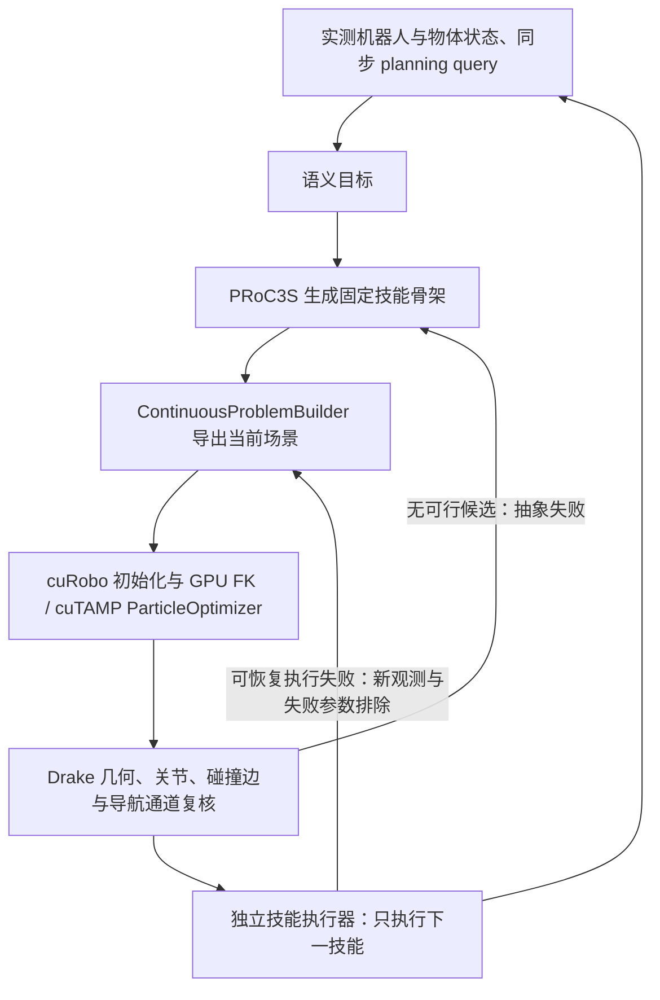

# cuTAMP 第三层接口接入

日期：2026-09-22。

## 执行路径



BT 与 TAMP 保持两条独立规划路线。cuTAMP 是几何求解后端，替换 PRoC3S CCSP 的拒绝采样位置；技能骨架生成和修改仍归 PRoC3S。没有把两个求解器串联，也没有引入新的骨架搜索器。

## 支持与边界

- 支持 `NavigateToPick`、`PickLift`、`NavigateToPick → PickLift`，以及空程序。其他结构明确拒绝。
- 单独导航保持一个执行动作。官方 `MoveFree/Pick` 是连续问题中的抓取可达性见证，不代表插入一个可执行 PickLift。
- 导航优化世界 XY 和左臂抓取关节，底盘高度／朝向保持当前锚点；单独 PickLift 固定当前底盘。抓取横向偏移从已有校准域采样，不称为梯度优化抓取。
- 25 个停车锚点根据当前实测物体和底盘朝向生成。世界 XY 的包围盒只是优化变量的粗界；额外可微凸包约束及独立后验检查防止旋转后扩大采样域。
- GPU 抓取关节值必须原样通过现有域检查，不得换成另一组 IK 后称其为 GPU 解。接近和抬升路点继续由现有 SceneSmith 检查求解。
- 每次在线求解使用新规划查询和新日志目录；携带失败上下文及已排除的参数。无可行候选按既有 `GeometricUnsat` 契约送回程序层，预算耗尽不等于数学不可解。
- 独立 CUDA 进程启动失败／配置或状态不一致直接报错，优化失败不会退回采样器。
- GPU 碰撞模型是近似球体／静态包围盒，尚无完整机器人碰撞模型等价性证明。Drake 后验检查和执行时检查保留；GPU 可行本身不代表物理成功。
- 未增加完整轨迹优化、全局绕障搜索、Place 或物体已夹住后的阶段内恢复。

## 入口

主入口新增显式 `--cutamp-config`，默认后端和原配置格式保持原行为。当前开发机配置保存在 `runs/cutamp-integration-20260922/cutamp_config.json`，各文件路径相对于该配置文件解析；虚拟环境 Python 保留其入口路径。

```bash
PYTHONPATH=. .venv/bin/python -m planner.src.tamp.cli \
  --planner tamp --skill-planner proc3s --geometry-backend cutamp \
  --cutamp-config runs/cutamp-integration-20260922/cutamp_config.json \
  --repository-root "$PWD" \
  --scene-root /root/scenesmith-simple-planner-eval/scene/scene_000 \
  --experiment experiments/navigation_picklift_tamp.json \
  --task 'Pick up the red object and hold it.' \
  --output-root runs/new_cutamp_run --record-html
```

该主入口命令使用实验本身的物体位置。复现此前 +X 10 cm 在线审计用：

```bash
PYTHONPATH=. .venv/bin/python scripts/run_current_tamp.py \
  --repository-root "$PWD" \
  --scene-root /root/scenesmith-simple-planner-eval/scene/scene_000 \
  --experiment experiments/navigation_picklift_tamp.json \
  --output-root runs/new_cutamp_shifted_run \
  --shift-world-x-m 0.10 --repeats 0 \
  --geometry-backend cutamp \
  --cutamp-config runs/cutamp-integration-20260922/cutamp_config.json
```

须使用新输出目录及既有模型服务环境变量。不要把密钥写进配置或日志。`max_samples` 属于 CCSP，cuTAMP 使用自己的粒子／梯度步数／后验检查预算。本轮初始配置：64 粒子、最多 2000 梯度步、最多 8 个候选的 Drake 后验检查、GPU 种子 500、配置学习率 0.001。语义与程序模型仍为真实在线调用。

## 验证结果

待本轮物理执行与回归结束后填入最终实测结果。
