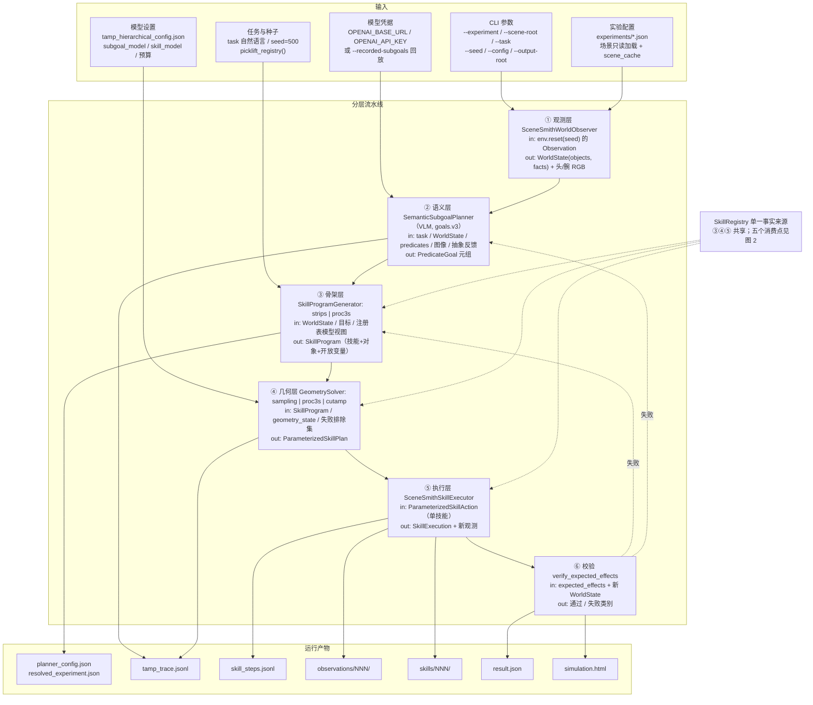
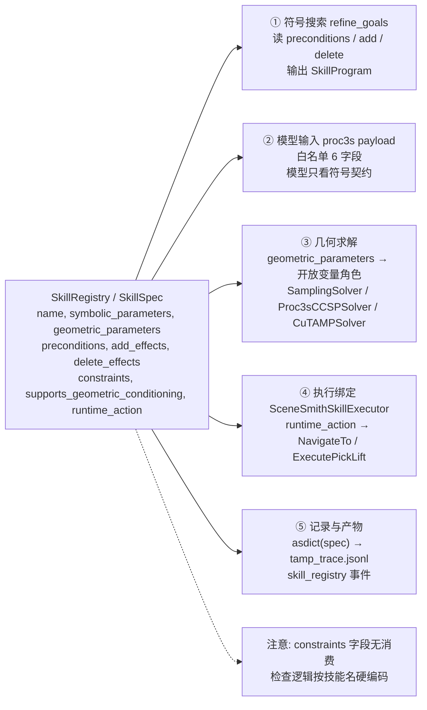

# TAMP 架构结构图

更新日期: 2026-09-21。范围: hierarchical 主路径（`--planner tamp --tamp-mode
hierarchical`），不含 legacy 消融与 BT 基线。

图 1 回答「输入是什么、输出有什么」，图 2 回答「skill 都用到了哪里」。图片由
`scripts/render_tamp_architecture.py` 生成，下面的 Mermaid 源码是同一结构的可
渲染版本。

## 图 1  主链路：输入 → 六层 → 产物




## 图 2  Skill 注册表用在哪些地方




## 输入清单

| 输入 | 载体 | 作用层 |
| --- | --- | --- |
| `--experiment` / `--scene-root` / `--output-root` | CLI | 全部 |
| `--task` | CLI 文本 | 语义层 |
| `--seed` | CLI（默认 500） | 观测 reset、CCSP 随机流、BT 执行 |
| `--config` | `experiments/tamp_hierarchical_config.json` | 模型设置、恢复预算、采样预算 |
| `--skill-planner` | `strips` \| `proc3s` | 骨架层 |
| `--geometry-backend` | `sampling` \| `proc3s` \| `cutamp` | 几何层 |
| `--recorded-subgoals` | JSON 文件 | 替换语义层模型调用 |
| `--base-candidate` | 浮点三元组 | 仅 debug 覆盖自动底盘候选 |
| `--base-url` / `--api-key-env` | 环境变量 | 模型 transport |
| 实验配置 | `experiments/*.json` | 环境、策略选项、运行选项 |
| 场景 | 只读 `scene_root` + `cache_root` | 观测、几何检查 |
| Skill 注册表 | `picklift_registry()`（内存） | 骨架、几何、执行 |

## 输出清单

| 产物 | 写入者 | 内容 |
| --- | --- | --- |
| `planner_config.json` | CLI | settings、task、seed、skill_planner、geometry_backend、record_html |
| `resolved_experiment.json` | CLI | 完整解析后的实验配置与 provenance |
| `tamp_trace.jsonl` | `JsonlTrace` | 决策事件流，见下表 |
| `skill_steps.jsonl` | `SceneSmithSkillExecutor` | 每个物理步的 policy 诊断、动作决策、机器人/物体状态 |
| `observations/observation_NNN/` | `SceneSmithWorldObserver` | `head_camera_rgb.png`、`*_annotated.png`、`*_annotations.json`、`manifest.json`（同帧时间戳与哈希） |
| `skills/skill_NNN/` | `SceneSmithSkillExecutor` | `skill_bt.json`（单技能 BT）、`result.json`、`parameter_consumption.json` |
| `result.json` | CLI | `success`、`reason`、`metrics`、`final_facts` |
| `simulation.html` | `--record-html` | Meshcat 回放（体积可达数百 MB） |
| `scene_cache/` | `load_experiment` | 迁根后的只读场景副本与 `manifest.json` 哈希 |

`tamp_trace.jsonl` 的实际事件类型（取自一次真实 proc3s 运行）：

`initial_world_state`、`skill_registry`、`semantic_model_request`、
`semantic_model_response`、`semantic_subgoal`、`skill_skeleton`
（采样后端为 `candidate_parameters`、`selected_parameters`；CCSP 后端为
`ccsp_assignment`、`ccsp_constraint_check`、`ccsp_solved`）、
`proc3s_model_request`、`proc3s_model_response`、`geometric_unsat`、
`geometry_failure_context`、`skill_execution`、`verifier_result`、
`recovery_action`、`final_result`。

## Skill 使用点

| # | 位置 | 用到的字段 | 产出 |
| --- | --- | --- | --- |
| ① | `refine_goals`（`tamp_hierarchy.py:201`） | `preconditions`、`add_effects`、`delete_effects`、symbolic/geometric 参数名 | `SkillProgram`（技能 + 对象 + 开放变量名） |
| ② | proc3s payload（`tamp_proc3s.py:159`） | 白名单 6 字段 | 模型可见的符号契约 |
| ③ | 几何求解（`tamp_geometry.py`、`tamp_ccsp.py`、`tamp_cutamp.py`） | `geometric_parameters` → 开放变量角色；`symbolic_parameters` 校验对象绑定 | `ParameterizedSkillPlan` |
| ④ | 执行绑定（`tamp_scenesmith_online.py:137`） | `runtime_action`、`supports_geometric_conditioning` | BT 叶子 `NavigateTo` / `ExecutePickLift` |
| ⑤ | 记录（`tamp_online.py:121`） | `dataclasses.asdict(spec)` 全字段 | `skill_registry` 事件（事后审计快照） |

两个边界：`constraints` 字段目前**没有任何代码读取**（`corridor`、`ik`、
`joint_edge`、`contact` 只是描述性标签，真实检查按技能名硬编码在
`SceneSmithPickDomain.check()`）；模型视图刻意去掉 `constraints`、
`runtime_action`、`supports_geometric_conditioning`，模型看不到运行时物理标签。

## 生成方式

```bash
python scripts/render_tamp_architecture.py --output-dir docs/assets
```

脚本需要 CJK 字体，按 `--font` 指定或放到脚本内置候选路径。仅改图内文案时改该
脚本的字符串，然后重跑；Mermaid 版本需与图片同步修改。
