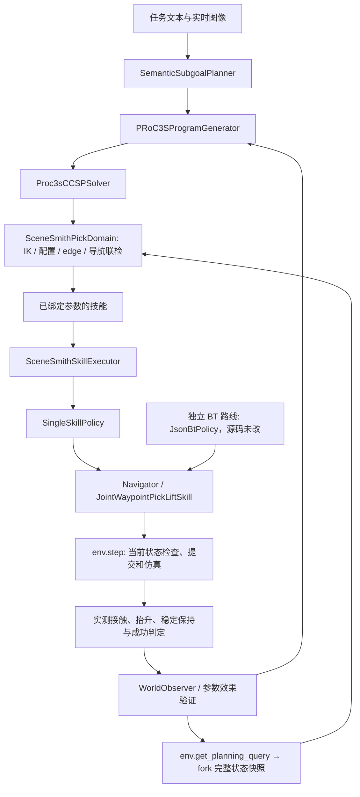

# TAMP 公共接口与独立技能执行：验证报告

日期：2026-09-22。工作目录：`/root/workspace/scenesmith-simple-planner-eval`。
本次范围是第一部分：整理在线 TAMP 的仿真接入和执行边界。

## 1. 改动与架构

BT 和 TAMP 是独立路线。BT 源码保持原样；TAMP 不再构造单叶 BT 或调用 BT 解释器。
两者继续复用现有 Navigator、PickLift 关节技能、环境动作检查与物理任务判定。



| 文件 | 改动 |
|---|---|
| `planner/src/skills/runtime.py` | `SkillInvocation` 和独立单技能策略；绑定现有控制器，保留闭合回执、失败与观测完成规则 |
| `planner/src/skills/navigation.py` | 保留原导航扫掠检查算法，检查前 fork，检查成功或异常均不污染输入查询 |
| `planner/src/tamp/scenesmith_online.py` | 执行独立技能；使用 `env.get_planning_query()`、`env.capture_cameras()`、`env.step()` |
| `planner/src/tamp/scenesmith.py` | 接收同时间戳的在线完整查询快照，候选站位只修改其独立副本 |
| `simulation/src/geometry/planning.py` | 新增 `fork()` 与 `set_robot_base_pose()`；IK 对固定自由体四元数采用单位化表示，保留原始快照 |
| `simulation/src/runtime/environment.py` | 新增当前时刻相机捕获的公共委托接口 |
| `planner/src/tamp/cli.py`、`scripts/run_current_tamp.py` | 在每次在线求解时提供当前环境查询 |

`fork()` 复制全部位置、速度和时间，避免仅复制观测表中的物体而遗漏其他场景状态。
模型本身共享，规划上下文独立；候选基座采用已有的 world 位姿转换工具。
`SceneSmithPickDomain` 构造时拒绝查询/观测时间戳不一致。
离线调用保留原有 observation-only 构造方式，在线正式路径显式传入完整查询。
几何实现仍使用 `PlanningQuery` 公开的高级 `plant/context` 接口；不获取真实 runtime 的 `plant_context`。

按“不要修改 BT 模块”的要求，本次没有把 BT 中的适配代码迁出或重写。
独立适配层保留等价的导航预检查、命令封装和闭合回执逻辑，并用原有闭合测试及导航等价测试约束行为。
实际控制器仍复用现有实现。

## 2. 保持的执行判据

- PRoC3S 程序生成、CCSP 搜索和已有有界恢复逻辑不变，没有增加另一套任务骨架搜索器。
- 不改变坐标系、单位、控制频率、关节步长、导航容差、碰撞检查、任务阈值或实验配置。
- PickLift 消费几何求解给出的 staging、approach、grasp 和 lift 关节路径。
- 闭合指令持续发布原控制器的最终目标；仅在环境最终接受后更新“最后接受目标”，拒绝与实际接触分别记录。
- TAMP 只在观测到任务成功后完成；不预测下一拍会满足保持时间。
- `execute_validated_joint_goal()` 保持原状；多阶段抓取和导航仍经 `env.step()` 执行。

在线 TAMP 输出改为 `skills/skill_NNN/skill.json`，诊断字段为 `skill_status`，
不再输出 `skill_bt.json` / `tree_status`。BT 的输出格式没有变化。

## 3. 全流程暴露的数值问题与修复

首次接入完整快照后，两轮真实模型试验均完成导航，但后续抓取几何求解耗尽预算。
随后用昨天的成功记录固定模型响应与候选参数，复现了完全相同的实际停车位，抓取 IK 仍失败。
因此，停车点变化不足以解释全部失败。

在同一个停车后状态、同一组抓取参数下，进行了三组几何对照：

| 查询输入 | 结果 |
|---|---|
| 旧 observation-only 构造方式 | 全部抓取几何检查通过 |
| 原始完整状态快照 | staging IK 失败 |
| 完整快照，仅将自由体四元数归一化 | 全部抓取几何检查通过 |

8.8 s 时，自由体四元数模长偏离 1 的最大值约为 `2.96e-6`，没有标量关节限位违规。
旧方式通过 Pose 接口复制观测时得到单位四元数；完整状态同步会保留积分后的原始值。
把这些原始值作为固定边界输入 IK，与 IK 的单位四元数约束冲突。

修复只在 `solve_ik()` 构造固定变量边界与初值时采用归一化的等价旋转表示。
不改写真实仿真状态，也不改写查询保存的完整测量快照；碰撞、位姿误差及任务成功阈值保持原值。
新增通用单关节机器人回归测试，分别覆盖模长略大于/小于 1，并验证求解后原始场景位置数组保持不变。

诊断证据：`runs/tamp-public-interface-20260922/parked_query_comparison/comparison.json`。

## 4. 验证结果

最新一次完整回归：**329 项，326 项通过，3 项跳过，0 失败/错误**，耗时 641.853 s。
日志：`runs/tamp-public-interface-20260922/regression-user-rerun.log`。
跳过项分别需要独立 torch 环境、CUDA、以及 real-A 场景的 `SCENE_ROOT`；不能视为已验证。
此前最终代码完整回归同样为 329 项、326 通过、3 跳过（643.765 s）；专门回归 31 项通过。
BT 的 9 个源文件 SHA256 与修改前一致；`git diff --check` 通过。

### 真实模型的完整仿真记录

| 试验 | 结果 | 原因 | 物理执行步数 |
|---|---|---|---:|
| `live_01` | 失败 | `semantic_replan_exhausted` | 78 |
| `live_02` | 失败 | `semantic_replan_exhausted` | 71 |
| `live_03` | 失败 | `recovery_preconditions_failed` | 131 |
| `live_04` | 失败 | `semantic_model_error` | 0 |
| `live_05` | 失败 | `recovery_preconditions_failed` | 462 |
| `live_06` | 失败 | `recovery_preconditions_failed` | 480 |
| `live_07` | 成功 | `task_goal_verified` | 208 |

`live_01`、`live_02` 是四元数修复前记录；`live_03` 已通过几何求解，但物理接触后的关节边检查拒绝动作，恢复前置条件也不满足。
`live_04` 模型服务连续三次连接失败，未开始执行。所有失败记录均保留。
`live_05` 完成导航并双指抓住物体、脱离支撑面，但实测抬升约 7.89 cm，未达到 8 cm 门槛，最终 `planned_hold_timeout`。
其停车水平距离 68.43 cm，二维相对位置与昨天成功点只差约 2.03 cm，说明距离接近也不能保证物理抓取成功。
`live_06` 在 `live_05` 等待原有超时判定时于独立仿真实例启动；两者没有共享仿真状态。`live_06` 曾提升至 8.028 cm，连续保持 2 s 后高度回落，最终同样超时。

**最新成功记录 `live_07`** 使用实时模型调用，最终 `task_goal_verified`，实测提升 **8.108 cm**，稳定保持 **3.100 s**；
双侧手指接触 `True`，支撑接触 `False`，意外目标接触 `[]`。
本轮模型调用 VLM 1 次、LLM 2 次；物理执行 208 步，墙钟耗时 243.503 s。
本轮记录的语义重规划 0 次、技能重规划 0 次、几何重试 0 次。

用户要求继续重规划直至成功后，使用原有单轮反馈恢复机制，并从同一 +X 10 cm 初始场景继续独立试验；每轮保留完整结果。
这种跨轮重试不等同于从任意失败接触状态连续恢复成功。

### 固定输入的集成回归

`reference_replay_03` 也成功：201 步，实测提升 8.596 cm、保持 3.100 s。
它重放昨天记录的模型响应和候选控制参数，重新计算全部 IK、边、碰撞以及物理结果；没有注入关节解、接触或成功状态。
该回归没有实时模型调用，单独标识，不计入上述真实模型试验。


### 全流程配置

使用真实模型的语义规划与 PRoC3S 程序生成，随后进行真实 Drake 几何检查、物理执行和观测验证。
沿用 `run_current_tamp.py` 的 +0.100 m world X 目标偏移；没有设置随机种子。
每次 CCSP 最多 16 个完整赋值；恢复预算沿用该脚本的现有设置。
`--repeats 0` 表示不额外运行符号反事实测试，不关闭真实在线模型调用。

沿用现有配置：名义提升 0.10 m，成功要求至少提升 0.08 m、稳定保持 3 s、双侧手指接触、
无支撑接触、无意外目标接触，且满足任务速度阈值。
现有目标—手指允许穿透上限是 1.0 m，支撑上限 0.0001 m；本次未修改，也不将该仿真结果解读为实机保证。

### 复现

在开发机加载已有模型服务环境变量后运行，勿将密钥写入报告或日志：

```bash
cd /root/workspace/scenesmith-simple-planner-eval
PYTHONPATH=. .venv/bin/python -m unittest discover -s tests -v
PYTHONPATH=. .venv/bin/python scripts/run_current_tamp.py \
  --repository-root /root/workspace/scenesmith-simple-planner-eval \
  --scene-root /root/scenesmith-simple-planner-eval/scene/scene_000 \
  --experiment experiments/navigation_picklift_tamp.json \
  --output-root runs/tamp-public-interface-reproduction \
  --max-samples 16 --repeats 0 --shift-world-x-m 0.10
```

输出目录必须未存在。完整调用、检查、执行和任务观测分别保存在模型 JSONL、TAMP trace、skill steps 与结果 JSON 中。

### 抬升不足的进一步排查

`live_05` 的 7.89 cm 中间帧已完成 FK 分解：刚性携带预测 97.919 mm，基座/关节跟踪损失 3.526 mm，闭合时相对位姿贡献 +0.389 mm，闭合后物体相对夹爪运动损失 15.874 mm，得到实测 78.908 mm。
执行器到最后路点后固定保持目标，没有物体高度反馈补偿。详细数据、曲线和能力缺口见同批交付的 `LIFT_SHORTFALL_DIAGNOSIS.md`。本次没有修改共享抓取控制器。

## 5. 交付物与边界

开发机完整证据目录：`runs/tamp-public-interface-20260922/`。

- 最新真实模型成功回放：`live_07/simulation_01_success.html`（原始 Meshcat 文件）。
- 便携回放：`live_07/replay.html`；对内嵌命令做无损 gzip 压缩，逐条解压校验，未简化几何或动画。
- 成功结果与执行审计：`live_07/live_result.json`、`live_07/artifact_audit.json`。
- 重试台账：`attempt_ledger.json`，包括所有真实模型失败与成功。
- 全量回归：`regression-user-rerun.log`；数值诊断：`parked_query_comparison/comparison.json`。
- 停车点专项比较：`PARKING_COMPARISON.md`、`parking_comparison.json`。
- 本机交付目录：`/home/hchen82/tamp-public-interface-20260922/`，含 `replay_live_success.html`、最终截图和本报告。


本次验证对象是正式在线 TAMP CLI 和 `run_current_tamp.py` 所用的独立执行路径。
旧 `planner/src/tamp/pipeline.py` 仍保留将整段计划转换成 BT 的历史实验路径，未纳入此次迁移；
`diagnostics.py` 的专用后端插桩也保留原状，不属于正式在线执行所需接口。
HTTP 模型客户端仍复用既有工具类，其所在模块名不代表 TAMP 经过 BT 规划或解释。

本次没有完成新的通用运动路径搜索、自动绕障或 cuTAMP 生产接入；这些属于后续工作。
单次完整仿真成功是本场景的流程证据，不是任意任务、场景或随机采样的成功率证明。

便携成功回放已在 Chrome 中检查：280 条内嵌命令无损校验通过，页面加载完成，0 个 JavaScript 异常，62 个动画动作，最终帧时间 20.796875 s。实际控制轨迹终点为 20.8 s。
