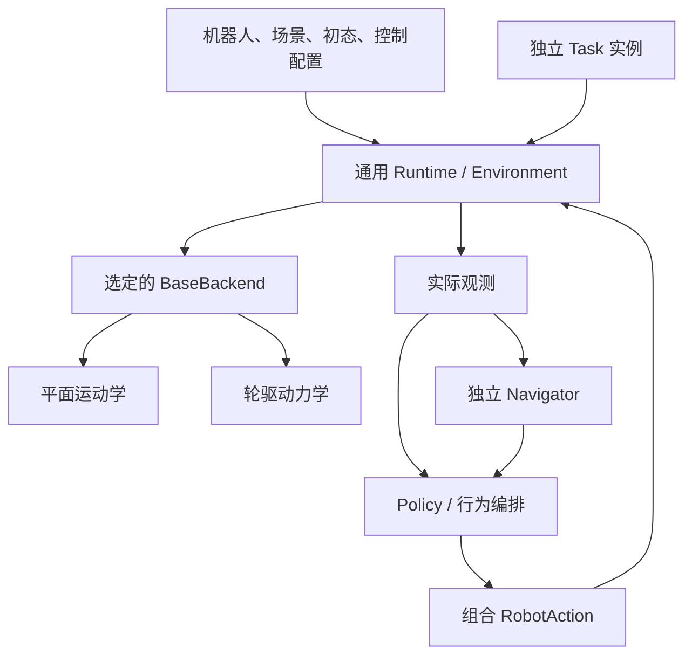

# 移动双臂仿真环境：架构与实施边界

版本：1.0 · 2026-09-07
依赖：`mobile_manipulation_requirements.md` 为行为与验收依据。
第1—10节保留实施任务书；当前已落地结构见第11节及后续收尾补充，实际验证
见progress，不能把最初建议直接当成完成证明。优先复用现有结构，不平行新建框架。

## 1. 已知背景与证据边界

此前 agent 报告：外层 OnlineManipulationEnv 基本通用，真实 ZerithOnlineEnv 仍包含左臂 7+1、特定模型构建及旧目标观测；规划与真实运行有两套构建逻辑；可变 Task 可能共享；新示例已部分移除专家依赖。这些是历史报告，必须核实当前工作树。

历史提及 HEAD b433ee6、130 项测试及固定 PickLift 成功，只作为基线线索，不能填成本轮实测。用户新增了双臂和两种移动底盘，前一版“单活动臂、固定底座”为本次显式扩展，不应当作阻止实施的限制。

## 2. 职责划分

| 组件 | 拥有的内容 | 不应拥有的内容 |
| --- | --- | --- |
| RobotAdapter/RobotDefinition | 模型构建、命名关节组、执行器、TCP、夹爪映射、相机、轮组、导航参考系 | 红盒、咖啡桌、专家预抓取位姿 |
| ScenarioSpec | 资产、对象注册、地面、渲染器配置 | 手臂固定维度、导航控制器 |
| InitialState | 底盘初始 pose、各关节/物体初态 | 永久硬件定义 |
| ControlConfig | 时钟、增益、模式参数、限制 | 任务成功条件 |
| Task | 任务对象绑定、允许接触、评价和终止 | 导航算法、模型加载 |
| Policy/行为编排 | 根据观测生成动作，导航后进入操作 | 直接改 Plant 状态 |
| Navigator | 目标解析、规划、跟踪、取消/失败状态 | 推进仿真、绕过公共接口 |
| BaseBackend | 运动学或轮驱执行与底盘状态获取 | 地图规划、PickLift |
| Runtime | 组合动作提交、物理推进、通用观测 | 专家阶段机 |
| Runner | 单一 reset/act/step 循环、记录 | 隐式解析专家 diagnostics 控制任务成败 |

Task 每环境独立构造；地图可只读共享，但规划进度、控制器状态和目标不可跨环境共享。

## 3. 建议组件关系



BaseBackend 是同一环境内部的执行策略，不是另一个持有时钟并独立 step 的环境。模块名可以调整，单一时间推进原则不变。

## 4. 动作生命周期

1. 在时刻 t 读取实际状态，解析本步 arm/gripper/base 动作及 Task 允许接触。
2. 验证名称、单位、frame、数值及能力；计算限幅后的候选目标。
3. 从一致状态评估共同动作；笛卡尔 IK 和关节分支都纳入明确的碰撞契约，不能只检查 Cartesian 分支。
4. 全部通过才提交指定目标；否则整体保留旧目标并返回拒绝原因。底盘旧速度命令在步边界过期，拒绝本步新动作时请求受控停车，不续发旧非零速度。
5. 在控制/物理子步执行已选 backend 与整机控制器；运行时接触/数值失败如实报告，不声称目标校验覆盖动态全过程。
6. 读取实际状态、更新 FK/相机/odom，Task 评价并返回结果。

双臂在同一时刻提交，不要求执行轨迹同步到达。原单臂动作可通过明确默认臂薄适配保持兼容；禁止通过两次 step 实现双臂。

## 5. 两种底盘模块

建议接口职责：初始化模型所需约束/执行器、reset 状态、接收本步速度命令、在 runtime 时钟下更新控制、输出实际底盘状态。具体方法名由代码结构决定。

### 5.1 PlanarKinematicBase

- 维护/约束平面自由度 x、y、yaw，按 v/omega 积分，应用速度加速度限制。
- 选择与当前 Drake 模型兼容的规定运动或约束方案，先做小型可执行原型证明与手臂控制器兼容。
- 每次候选位移检查扫掠碰撞；受阻时停止接受穿障运动并报告，不靠单终点检查。
- 底盘状态必须进入整机模型，使 TCP、相机、碰撞位置同步改变；轮子可作显示性转动，但不把它描述为动力学驱动。
- 明确运动学约束对反作用力的限制，不能同时隐式开启自由体轮驱又覆盖 pose。

### 5.2 WheelDrivenDynamicBase

- 可移动底座、轮关节执行器和正常接触构成动力学模型。若引入平面物理约束而非自由底座，需明确记录限制，不伪称完整六自由度车辆动力学。
- 在理想等半径定义下：wheel_left=(v-omega*b/2)/r，wheel_right=(v+omega*b/2)/r；映射实际关节轴符号。半径不同则分别换算。
- 轮速误差经限幅控制器产生力矩；底盘实际运动由模型求解，不能修改 base pose 来追上导航路径。
- 支撑轮零摩擦只用于确认的四个辅助几何；记录修改前后属性、接触和载荷证据。
- 原固定底座逆动力学控制器不能默认可直接用于移动基座。核实自由度/执行器映射、未驱动自由度、重力与耦合项；不靠索引截断凑维度，不把底盘当隐形固定基座。
- 停车控制在双臂操作期间继续工作，报告漂移，不做 world 重焊。

### 5.3 配置与替换

创建时配置 `base.mode = planar_kinematic | wheel_dynamic`；原 fixed 模式可为回归保留，但不计入两种移动模式完成。

两模式共享公开动作/观测和 Navigator，分别拥有可审查的控制限制。记录 mode、控制参数、地图/机器人配置版本。禁止使用动力学标签实际回落运动学；模式不可用应明确失败。

## 6. 坐标和导航目标

采用 T_A_B 表示 B 在 A 中的位姿，点变换 p_A=T_A_B*p_B。
接收时：T_world_goal=T_world_reference(t_accept)*T_reference_goal。

world/map/odom 第一版可固定对齐；odom → base_link 来自实际仿真状态。若另有 base_footprint/navigation frame，机器人配置给出与实体 base_link 的关系，避免 base_link 高度被误判为平面目标错误。

导航目标含 frame_id、完整姿态和位置或等价平面 pose，必须包含最终 yaw。对任意 link，先完整变换再检查是否满足导航参考平面。拒绝未知 frame、非有限数、无效四元数以及非平面目标；记录解析时刻，不要求实现历史 TF 缓存。非当前时间戳若不支持，明确拒绝。

不自动给 Cartesian 增加所有局部参考系；本次 local pose 支持首先是 Navigator 的功能。底盘一旦移动，规划查询必须同步当前实际底盘位姿，不能沿用初始焊接位姿。

## 7. 导航实现选择

1. 从场景碰撞几何构建可复现静态地图；明确高度筛选、分辨率、边界和机器人足迹。模型几何不足时报告，不用视觉网格替代后隐瞒。
2. 选择可支持倒车/原地旋转的规划及跟踪方案。可用 SE(2) 格点搜索，也可使用位置搜索配合经过足迹验证的转向/倒车段；具体算法由 agent 选择并证明满足测试。
3. 原地转动也检查扫掠，不能只检查中心点。采用保守包络可接受，但要报告因保守性拒绝的通道。
4. 跟踪器只输出限幅 v/omega，读取实际速度/位姿。接近目标调整最终 yaw；偏航误差使用 wrap 到最短角。
5. 成功条件同时满足位置、yaw、实际速度及连续仿真时间窗口；任一超差清零稳定计时。
6. 无路径、超时、停滞/受阻、取消分别有状态。受阻检测阈值明确可配置，取消以停车完成为结束。
7. Navigator reset 清除目标、路径、积分状态和计时器。用户重新设目标时明确替换旧目标及重新规划。

## 8. 导航与操作编排

状态：收拢并验证 → 导航 → 连续满足配置的到达与停车阈值 → 双臂操作 → 完成/失败。这里的停车不是完全静止，也不是锁死底座。

导航前验证当前臂姿符合用于地图/足迹的配置；不满足先收拢，失败不启动导航。底盘操作权由编排明确分配。导航到达后继续输出停车请求；双臂操作期间监测底盘误差。直接底盘控制需取消导航并完成交接。

最终示例必须使用公共接口，不能在 demo 中调用 SetFreeBodyPose、移动物体、焊接底座或注入专家成功状态。

## 9. 实施顺序与迁移

按 progress 中 P0—P7 推进。每阶段保留可运行路径，不做没有验收证据的全面重命名。先明确配置与模型构建，再双臂，再两种移动 backend，再导航和端到端集成。

建立原 fixed PickLift 基线；架构阶段不改摩擦/增益/抓取参数。轮驱阶段必要的轮组接触与轮速控制修改单独记录，不能混入夹爪/红盒参数。移动底盘结果与固定底座结果分别记录，不要求哈希等价。

旧入口最终转调新组装链。示例应展示：无任务 Hold、双臂组合、两种底盘选择、世界/local pose 导航、导航后双臂操作。使用相同公共接口的仓库外客户端验证可用性，而不是只在内部测试注入私有状态。

## 10. 需要说明的能力限制

动作边检查与导航静态碰撞检查都不代表动态接触安全证明；运动学模式不模拟轮地牵引；真值里程计不是编码器定位；固定示例不是随机泛化；双臂独立目标不代表协同闭链控制。文档应准确披露这些边界，同时完成需求中已明确的真实运行验收。

## 11. 实际实现映射（2026-09-08，online-env-v0.3）

| 职责 | 实际路径/入口 |
| --- | --- |
| 通用执行 | `src/online_manipulation/runtime.py::RuntimeConfig/DrakeRuntime`，外层仍为 `make_env → OnlineManipulationEnv` |
| 统一模型 | `model.py::populate_model`，仿真与规划同一定义，默认同一Plant、独立Context |
| 可替换机构 | `adapters/description.py::DescriptionRobotAdapter`，真实两轴无夹爪fixture已运行 |
| 双臂定义 | `adapters/zerith_dual.py::make_zerith_dual_spec/ZerithDualRobotAdapter` |
| 移动机器人 | `adapters/zerith_mobile.py::ZerithMobileRobotAdapter`，拥有轮组、轴符号、安装frame及移动collision |
| 底盘执行 | `base.py::PlanarKinematicBase/WheelDrivenDynamicBase`，同一Runtime时钟 |
| 相机 | `sensors.py::CameraSystems`，RobotSpec.cameras来自机器人，renderer来自ScenarioSpec |
| 静态导航 | `navigation.py::Navigator`，`navigation_geometry.py::build_navigation_map` |
| 任务编排 | `examples/online_manipulation/navigation_manipulation.py::NavigateExercisePolicy/ParkedExerciseTask` |
| 旧入口 | ZerithEnvironmentConfig使用共享Runtime；`src/zerith_online_env.py`保留旧8维/字典薄转发，无第二物理循环 |

RobotSpec是工厂组装后的描述对象，包括本次解析后的初态和servo字段，不再为episode复制另一份硬件JSON。`models/zerith_pick_eval/environment.json`分为`initial_state/control/scene_bindings/task`；专家IK/PREGRASP仅Policy读取。每个环境独立复制Task，Runner通过显式`StoppablePolicy.stop_reason`取得策略终止原因，不解释专家diagnostics字段。

### 11.1 动作与观测契约

- `RobotCommand(arms={名称: ArmAction}, grippers={名称: GripperAction}, base=BaseVelocityAction(...))`一次step统一提交。同步接受不代表同步到达。
- 各臂支持关节绝对/增量和Cartesian绝对/增量。名字从`spec.arm_groups/end_effector_frames`获取，不靠切片。夹爪宽度单位米，Zerith范围`[0,.07628]`；每侧映射两个手指，非单指行程。
- Cartesian保持world表达、commanded臂FK基准、实际手指几何、左乘world rotvec；每tick一次局部IK。abs必须持续提交，限幅残差不会在后台追踪。未新增局部Cartesian模式。
- 新组合动作对共同配置edge进行校验；任何指定分量失败，所有旧目标不变，仍推进仿真。`info['action_decision']`包含整体accepted、reason、components、edge证据。旧固定单臂空手JointDelta保持原行为；本轮明确补齐携物关节动作的edge检查，不再遗漏携物碰撞。
- 默认step=.1s，20个.005s控制更新，每控制5个.001s物理更新。base速度命令仅本tick有效；省略base或Hold均按限幅制动。
- `BaseVelocityAction(v,omega)`：m/s、rad/s；navigation_frame的+X向前、世界+Z逆时针为正。
- `obs.robot`含具名q/v/q_commanded/torque、`end_effectors/gripper_widths_m/frame_poses_world`。`obs.base.pose`是导航参考点，另有物理`base_link_pose`和`odom_from_base_link/odom_from_navigation`，不能混用原点。
- 相机图像、pose、timestamp同帧采样保持。离散事件采样更新前状态，而同时间戳robot.q为更新后状态；移动测试用物理步速度误差界核对，不用最新FK覆盖缓存pose。reset返回t=0真实帧。
- `env.get_planning_query()`同步完整实际底座/关节/自由物体到独立规划Context，`state_time_s`记录时刻；每step/reset后重新获取。单独`build_planning_query`是初态查询，不会自动跟随环境移动。

### 11.2 两模式与导航假设

- 模式在创建时选定，不支持热切换。运动学为锁定PlanarJoint的规定小步运动，每1ms检查起点/中点/终点整机proximity，受阻返回`base.blocked/blocking_pairs`；不伪称自由体动力学或牵引响应。TCP公开速度补上规定底盘运动分量。
- 轮驱root保留6DOF，仅真实轮执行器受力矩；不覆盖root pose/velocity。左右轮轴+Y/−Y，r=.0835m、轮距=.379m；速度分别`(v−omega*b/2)/r`与`−(v+omega*b/2)/r`。模型限制2.3rad/s、60Nm与运行限制取较小者。
- 默认运行限速v=.15m/s、omega=.6rad/s、加速度=.25m/s²、角加速度=.8rad/s²、轮速servo gain=30。它们不是硬件标定。
- 仅四辅助轮collision摩擦置0并调平，两个驱动轮改r=.0835m圆柱。visual/惯量及地面/夹爪/物体摩擦不改。六轮实际承重，但辅助滑动支撑不等同真实脚轮。
- 规划压缩容差2mm只属于六具名轮—ScenarioSpec显式`ground_body_names`配对，不扩展Task指—目标容差，不修改动力学filter。
- 地图来自实际proximity高度范围+AABB障碍、整机保守圆盘；本示例双肘1.4rad、半径约.41566m。格点.1m、边采样.025m，包含旋转与倒车占地，但可能保守拒绝窄道。
- 本轮导航平面world Z=0。真实动态nav frame可能因沉降/倾角略偏离平面，观测不隐藏该事实；local/link目标须完整变换后成为平面pose。不能把有高度的物理base_link局部Z=0当作地面。
- `NavigationGoal(Pose(...), frame_id=...)`始终包含最终yaw；原始目标、解析时刻和world目标保留。目标不会跟随后续link运动。未知frame、非平面目标明确拒绝。
- Navigator只输出动作，不调用step。其速度带`control_owner='navigation'`，环境拒绝其他owner竞争。取消后继续`env.step(navigator.act(obs))`直到实测停车窗满足且状态cancelled。arrived/cancelled后`navigator.release()`，再发送一次`BaseVelocityAction(0,0,control_owner='navigation',release_control=True)`显式交接。
- 成功条件保持3cm、3°、.01m/s、.02rad/s且连续.5s。当前完整示例是导航停车后双臂关节运动和两空夹爪到宽度，**不是双臂协同抓取/搬运**。

操作阶段首次组合动作发送具名owner的零速度请求并释放导航控制权；之后`base=None`在每个step显式过期为零速度请求。轮驱通过零轮速目标的受限轮速伺服制动，不进行世界位置/yaw闭环保持，也不重焊；运动学限幅速度降至0后不再积分位移。操作阶段的相对起点偏差和实际速度统计见progress第13节，只有已有10Hz日志样本，不代替物理子步峰值。

## 12. 可复制运行

在仓库根执行；直接使用`.venv/bin/python`，无需activate。首次安装/submodule/OBJ生成沿用中文Quickstart。移动场景自包含，不依赖SceneSmith资产，但需生成`models/zerith_drake/meshes/*.obj`。

```bash
cd /root/workspace/scenesmith-simple-planner-eval
export REPO_ROOT="$(pwd)"
export PYTHON="$REPO_ROOT/.venv/bin/python"
mkdir -p "$REPO_ROOT/output"
export RUN_ROOT="$(mktemp -d "$REPO_ROOT/output/mobile_review_XXXXXX")"
"$PYTHON" -m examples.online_manipulation.navigation_manipulation --mode wheel_dynamic --output "$RUN_ROOT/wheel" --meshcat
"$PYTHON" -m examples.online_manipulation.navigation_manipulation --mode planar_kinematic --output "$RUN_ROOT/kinematic" --meshcat
```

两命令已实跑通过，打印`success: True`、`parked_dual_targets_held`。每模式保存`episode_000_seed_0/{simulation.html,summary.json,trace.csv}`与benchmark汇总。运行时Meshcat URL见终端；远程查看需转发对应端口。运行结束可下载HTML本地打开，每份约225MiB。输出用新目录避免覆盖旧证据。

仅底盘/仅导航/局部坐标和受阻回归：

```bash
"$PYTHON" -m examples.online_manipulation.mobile_smoke --mode wheel_dynamic --output "$RUN_ROOT/wheel_motion"
"$PYTHON" -m examples.online_manipulation.mobile_smoke --mode planar_kinematic --output "$RUN_ROOT/kinematic_motion"
"$PYTHON" -m examples.online_manipulation.navigate_demo --mode wheel_dynamic --output "$RUN_ROOT/navigation" --meshcat
"$PYTHON" -m examples.online_manipulation.validate_mobile_navigation --output "$RUN_ROOT/navigation_cases"
```

仓库外客户端只导入公共API，保存三相机RGB/深度、JSON并检查移动后规划快照的TCP和时间：

```bash
cd /tmp
PYTHONPATH="$REPO_ROOT" "$PYTHON" "$REPO_ROOT/examples/online_manipulation/mobile_public_api_client.py" --repo-root "$REPO_ROOT" --mode wheel_dynamic --output "$RUN_ROOT/external_wheel"
PYTHONPATH="$REPO_ROOT" "$PYTHON" "$REPO_ROOT/examples/online_manipulation/mobile_public_api_client.py" --repo-root "$REPO_ROOT" --mode planar_kinematic --output "$RUN_ROOT/external_kinematic"
cd "$REPO_ROOT"
PYTHONPATH=tests:. "$PYTHON" -m unittest discover -s tests -v
```

客户端中一次step的关键形式（完整可运行构造在上述文件）：

```python
action = RobotCommand(
    arms={side: JointDeltaAction((spec.arm_groups[side][0],), (-0.004,))
          for side in ("left", "right")},
    grippers={"left": GripperAction(0.060), "right": GripperAction(0.055)},
    base=BaseVelocityAction(0.06, 0.1),
)
obs, reward, terminated, truncated, info = env.step(action)
query = env.get_planning_query()  # 当前实际状态，不访问私有Context。
```

固定PickLift仍依赖外部SceneSmith资产、派生DMD和专家Policy文件；其回归命令见progress。不要把自包含移动演示说成在任意生成场景中验证过。

## 13. 整体迁移收尾：当前实际调用与契约

- 旧 `scripts/run_zerith_online_example.py::build_run` 调用
  `pick_lift_demo.minimal_setup.make_config` 和仅专家使用的 `policy.build_policy`，
  随后与新CLI共用 `examples.online_manipulation.run_online.run`。
  场景绑定/初态/Task无第二份来源；旧CLI控制默认值作为显式覆盖保留。
  Hold/JointStep不读专家JSON。配置字段和兼容差异见GENERIC第7节。
- `model.validate_actuator_mapping` 在构建时验证受控单自由度关节的唯一
  `<joint_name>_actuator`；Drake1.49在Finalize前需从全执行器列表按model
  instance筛选，不能使用尚未填充的instance列表。具名夹爪签名与Runtime
  实际调用一致，未知/缺少夹爪明确异常。
- Task拥有单目标carrier身份与允许接触，Runtime只消费通用CarriedBody。
  `PickLiftTask.allowed_contacts` 核对arm/gripper/frame，支持旧单臂、Composite、
  RobotCommand。`DrakeRuntime.check_command_edge` 在几何检查中区分受限闭合
  指令目标与实际手指接触位姿；旧关节resolver也调用它。真实动力学/filter不变。
- TAMP helper在执行前自动获取实际规划快照；不是新增Environment必选接口，
  不破坏不需要规划的第三方EnvironmentConfig。内置runtime有该能力。
- 所有新的双臂Cartesian精度结论只覆盖测试定义的可达小邻域；abs/delta的
  表达系、旋转组合与累加基准完整列于GENERIC第8节。
- 原相机hardening、v0.1/v0.2历史验收迁入GENERIC第10—11节；三份旧文档
  删除保留。相机外参和渲染参数未因本轮修改；版本核验见progress第15节。
